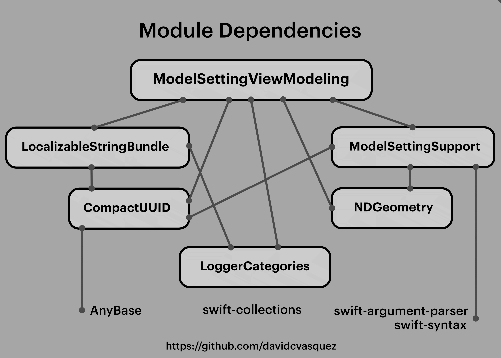

## Introduction
These repos contain open source software development tools for iOS, iPadOS, and macOS.

Our current focus is on a new package for SwiftUI developers, named `ModelSettingViewModeling`, that provides a live, composable user interface, where users and developers can customize model setting views while the app is running. This capability enables many UI changes to be made without any code changes.

A "customize settings" UI is provided to enable reordering Model setting views, toggling visibility, and even renaming setting labels, where names are retrieved from a live localized string bundle that is managed in the Application Support directory.

Users can also choose from a variety of viewing styles, including adaptive layout, compact or expanded layouts, or create their own custom layouts with specific combinations of text and icon labels and various forms of control surfaces.

## Follow me on socials
- [Follow me on LinkedIn](https://www.linkedin.com/in/david-vasquez-81652b20)

## Open source projects

* ModelSettingViewModeling
* [ModelSettingSupport](https://github.com/davidcvasquez/ModelSettingsSupport) Swift macros to generate type ID, name, and properties for model settings, suitable for registration as a `ModelSettingPropertiesContainer` and subsequent reference for UI layouts.
* LocalizableStringBundle
* [NDGeometry](https://github.com/davidcvasquez/NDGeometry) A collection of Swift geometry types suitable for calculations on background threads, an extension of `CGAffineTransform` that provides X and Y shear transforms, and curve fitting of one or more cubic Bézier segments to a polyline.
* [CompactUUID](https://github.com/davidcvasquez/CompactUUID) A compact representation of a `UUID`, along with a CLI tool and an Xcode Source Editor extension.
* [LoggerCategories](https://github.com/davidcvasquez/LoggerCategories) A protocol for custom `Logger` categories, with an extension to `Logger` that provides wrappers for each type of log entry.

## How the projects are organized
  

<!--
- 🔭 I’m currently working on ...
- 🌱 I’m currently learning ...
- 👯 I’m looking to collaborate on ...
- 🤔 I’m looking for help with ...
- 💬 Ask me about ...
- 📫 How to reach me: ...
- 😄 Pronouns: ...
- ⚡ Fun fact: ...
-->
